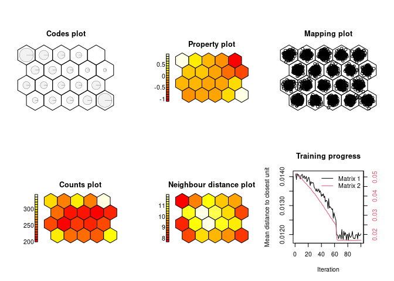
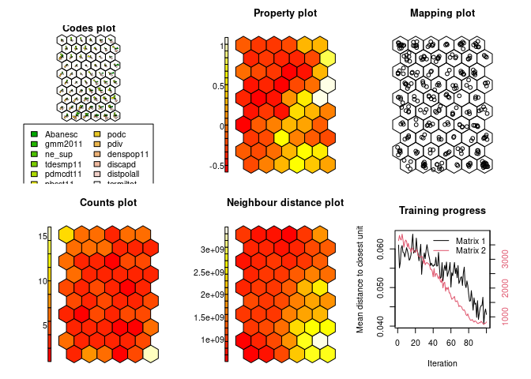

# 1. Introduction

The Self-Organising Map (SOM) is a type of Artificial Neural Network
(ANN) first proposed by Finnish scientist Teuvo Kohonen in 1982. It’s
main uses are in data clustering and dimensionality reduction. Features
with any number of attributes are projected onto a lower-dimensional
neural network (commonly 1-, 2- or 3-dimensional) for the purpose of
simplification, visualisation or pattern analysis. In order to improve
it’s usefulness for spatial data science, the SOM can be modified to
consider geographic proximity during it’s learning. The result is
clustering that is geographically coherent and can provide additional
insights into the source data.

The spatially aware SOM (GeoSOM) was developed at the New University of
Lisbon (UNL) in the early 2000s and a software suite was created in
MATLAB. The software installer requires Windows and the source code
consists of MATLAB .m files. Thus, a free and open-source implementation
is currently not available to researchers or the public.

# 2. Sample Data

Example data has been created for the GeoSOM Suite to demonstrate the
capabilities of the MATLAB-based GeoSOM software developed at UNL.
Available at [GeoSOM
Repository](https://www.isegi.unl.pt/labnt/geosom/georepository/) (Lobo,
2009), two of the datasets are included here. Both datasets have a
single non-spatial attribute, such that clustering would depend entirely
on this property in the traditional SOM. Using the GeoSOM, however, we
expect the clustering to also be partially spatially dictated. The third
dataset consists of real-world demographic metrics and tests the true
functionality of the GeoSOM.

## 2.1. Squareville

*Squareville is an artificial dataset purposely created to use in GeoSOM
suite. Squareville is a small-town with square boundaries and an area of
10000 m2. Squareville has 100 houses evenly spaced with coordinates x in
\[5, 95\] and y in \[5, 95\]. For each house we know the average salary,
which is s in \[900 1000\] for 35\<=x\<=65 and s in \[0 100\] * This
simple scenario consists of 100 houses in a regular grid. Roughly
divided into thirds, the first and last third have significantly lower
values for “average salary” than the middle third. Traditional
clustering simply yields two clusters, for rich and poor (high and low
values). Incorporating a geographic constraint, we expect the poor
cluster to differentiate into an “eastern” and a “western” poor area.

## 2.2. Four Corners

*The points follow a uniform distribution in the geographical
coordinate, within the rectangle limited by \[(0,0),(20,5)\]. In the
non-geographical dimension there are three zones of high spatial
autocorrelation, where the values of z are very similar among
neighbouring points, with a uniform in \[90,91\] in two zones and
\[10,11\] in another. There is also one area of “negative
autocorrelation”, where half the data points have z==0 and the other
half have z==90. In the rest of the input space z has a uniform
distribution in \[0,100\]. * This feature space has 5000 points in a
regular grid, with five distinct zones (also based on a single
non-spatial attribute). Simple SOM clustering would group these points
according to value only, whereas we would expect the GeoSOM to create
geographically separate clusters in the four corners as well as
(depending on the model parameterisation) within the one corner with
high negative autocorrelation.

## 2.3. Project 3: Portugal Census

The 2011 Portugal Census data contains the centroid coordinates and 11
selected socio-economic variables for the 278 municipalities of
Portugal. A conventional SOM would classify municipalities solely on
socio-economic metrics. For example, highly urbanised municipalities
would be grouped together regardless of geographic proximity, because of
similar socio-economic characteristics. The same is true for various
levels of rural municipalities. We expect the GeoSOM classification to
differentiate between Lisbon, Porto and Coimbra. We also expect the
final result to produce contiguous clusters of data points.

# 3. Methodology

The GeoSOM takes an additional parameter *k*, which can be defined as
the spatial weight. With *k=0* space is disregarded and the GeoSOM
functions exactly as a traditional SOM. As the value of *k* increases,
spatial proximity increases in significance. With *k=1*, the feature
space and geographic space have equal weight. To incorporate this
constraint Bacao *et al* (2004) filtered neurons by proximity during
every learning iteration and the best matching unit (BMU) could only be
selected from a proximal subset of all the neurons in the map. Thus,
with a single feature selected, the geographic distance to every neuron
is calculated and distal neurons are excluded from consideration. Then
the vector distances in the feature space are calculated (as per the
normal routine) and the BMU selected. The rest of the learning process
is identical to a conventional SOM.

In this package, the geographic space is regarded as a separate data
layer with modifiable importance (*k*). The function *geosom* is a
wrapper for the *supersom* routine (similar to *som* and *xyf* in the
kohonen package). The user passes the data along with the weight *k*,
and the labels of any coordinate columns in the data frame. The user
also specifies whether non-spatial data should be normalised. The
*geosom* function strips the spatial data into a separate data frame and
does *not* normalise it. Non-spatial data is normalised if requested,
and *supersom* is called with *normalizeDataLayers* set to FALSE.

For demonstration and consistency, a hexagonal grid of 5x4 neurons is
used in the first two examples. In the Portugal dataset, a 6x10
hexagonal grid is used.

## 3.1. Initialisation

``` r
library(kohonen)
library(Rcpp)
```

## 3.2. The geosom function

``` r
# geosom function

# call geosom by specifying data, coordinate labels, and spatial weight
# data as data.frame
# coords as a list of coordinate column labels
# k as a decimal number from 0 to 1
# norm as Boolean

"geosom" <- function(data, coords, k, norm, ...) {
  # subset spatial data
  geodata = data.matrix(data[,(names(data) %in% coords)])
  # subset non-spatial data
  data = data.matrix(data[,!(names(data) %in% coords)])
  spatial.weight = c(1, k)
  # if data to be normalised, we do it here
  # xyz cannot be scaled disproportionately
  if (isTRUE(norm)) {
    data = scale(data)
  }
  # disregard geography if spatial weight is zero
  if (k==0) {
    supersom(list(data), normalizeDataLayers=FALSE, ...)
  } else {
    supersom(list(data, geodata), user.weights=spatial.weight, normalizeDataLayers=FALSE, ...)
    }
  }

"geosomgrid" <- function(x,y) {
  somgrid(x,y,"hexagonal", "gaussian")
}
```

## 3.3. Parameter Definition

``` r
# Parameterisation
som_x = 5                 # neural map horizontal size
som_y = 4                 # neural map vertical size
norm = TRUE               # normalise input data

set.seed(151)             # to ensure reproducibility, 
                          # but is apparently ineffective here
minor.grid = geosomgrid(som_x, som_y)      # neural map grid
major.grid = geosomgrid(2*som_x, 2*som_y)      # neural map grid
```

## 3.4. Visualisation plotting function

This is a utility function to view SOM results at a glance, with 6 plot
types displayed in a single figure.

``` r
# plot function 3 x 2
"show_results" = function(kohobj) {
  par(mfrow = c(2, 3))
  codes = getCodes(kohobj)
  # in the case of >1 attribute, only the first is plotted in "property" plot
  if (is.list(codes)) {
    plot(kohobj, type = "codes", whatmap = 1, shape="straight")
    plot(kohobj, type = "property", property = codes[[1]][, 1], shape="straight")
  } else {
    plot(kohobj, type = "codes", shape="straight")
    plot(kohobj, type = "property", property = codes[, 1], shape="straight")
  }
  plot_types = c("mapping", "counts", "dist.neighbours", "changes")
  for (plot_type in plot_types) {
    plot(kohobj, type = plot_type, shape="straight")
  }
}
```

# 4. Results

## 4.1. Squareville

``` r
# Data
data(squareville)
head(squareville)
```

    ##   X  Y   S
    ## 1 5  5 951
    ## 2 5 15 993
    ## 3 5 25 923
    ## 4 5 35 926
    ## 5 5 45 929
    ## 6 5 55 998

``` r
# Conventional SOM:
som.model = som(data.matrix(squareville$S), grid = minor.grid)
show_results(som.model)
```


The conventional SOM produces a very clear binary classification, based
on the single non-spatial variable *S*, into a low- and a high-value
cluster.

``` r
# GeoSOM:
geosom.model = geosom(data = squareville, 
                      coords = c("X", "Y"), 
                      k=3, 
                      norm = norm, 
                      grid = minor.grid)
show_results(geosom.model)
```


The GeoSOM produces three distinct clusters: one low-value, and two
spatially separated high-value clusters.

## 4.2. Four Corners

``` r
# Data:
data(four_corners)
head(four_corners)
```

    ##       X     Y     L
    ## 1  2.59 11.85 10.88
    ## 2 17.15 10.96 90.06
    ## 3  3.01 10.31 10.33
    ## 4  8.65  5.87 52.33
    ## 5 14.35  7.77 49.93
    ## 6 10.71  7.74 94.99

``` r
# Conventional SOM:
som.model = som(data.matrix(four_corners$L), grid = minor.grid)
show_results(som.model)
```


Similar to the Squareville result, the conventional SOM produces a
binary classification into a low- and a high-value cluster. However, the
distinction is more gradual and a third cluster of intermediate values
may also be discerned.

``` r
# GeoSOM:
geosom.model = geosom(data = four_corners, 
                      coords = c("X", "Y"), 
                      k = 3, 
                      norm = norm, 
                      grid = minor.grid)
show_results(geosom.model)
```



The GeoSOM results are more open to interpretation but show four very
distinct clusters. A fifth and sixth may also be defined, each with
increasingly fuzzy boundaries.

## 4.3. Project 3: Portugal Census

``` r
# Data:
data(project3)
head(project3)
```

    ##   Abanesc gmm2011    ne_sup tdesmp11 pdmcdt11  pbsst11  podc     pdiv denspop11
    ## 1    1.97  969.71 10.253651     13.6 0.059888 0.742530  86.8 0.203433  55.02378
    ## 2    1.48  919.96  9.725704     10.1 0.034679 0.328940  85.2 0.272371 142.35820
    ## 3    0.97  692.25  4.648293      8.9 0.229984 0.749132  61.6 0.073086  26.46953
    ## 4    0.70  764.72  4.982619     15.6 0.069160 1.112442  57.1 0.102687  10.76697
    ## 5    1.25  909.51  9.518236     10.4 0.225804 0.300966  80.2 0.205924 158.99260
    ## 6    1.96  913.89 11.494990     17.2 0.118196 0.991966 102.8 0.259626 290.25194
    ##   discapd distpolall tcrmiltot centroidx centroidy
    ## 1 49813.7   6763.774  26.39542  -2125.85  -26872.2
    ## 2 23220.1   6135.107  32.16074 -22224.80  101936.0
    ## 3 32855.2   6166.988  23.20482  51046.80  123750.0
    ## 4 46776.2   6664.486  16.94335  65335.10 -116583.0
    ## 5 15457.6   4488.527  34.01711 -30628.40  114637.0
    ## 6 30102.4   3083.984 103.62986  -8846.02 -281339.0

``` r
# initialise a special grid for larger dataset
# 'landscape' orientation to accommodate Portugal's geography
pt_grid = geosomgrid(6,10)
# Conventional SOM:
som.model = som(data.matrix(project3[,!(names(project3) %in% c("centroidx","centroidy"))]), 
                grid = pt_grid)
show_results(som.model)
```


The SOM yields 5-7 classes (depending on interpretation). Classes have
comparatively fuzzy borders, which is expected of real demographic data.
Lisbon’s and a few of Porto’s municipalities are the most distant from
other classes, with many socio-economic metrics that are orders of
magnitude removed from the rest of the nation.

``` r
# GeoSOM:
geosom.model = geosom(data = project3, 
                      coords = c("centroidx","centroidy"), 
                      k = 5, 
                      norm = norm, 
                      grid = pt_grid)
show_results(geosom.model)
```



In the GeoSOM classification, many more classes can be discerned. Urban
regions are geographically classified, as expected. Rural areas that are
very close in the feature space are now separated by geographic space.
The 60 neurons now yield between 16 and 21 clusters.

# 5. Discussion

In the simple Squareville example, the effect of spatial weight is
obvious. The cluster of high-value data points is split into ‘eastern’
and ‘western’ clusters, allowing more informed conclusions to be drawn.
The 4 Corners example is similar: the single-dimensional non-spatial
data clusters into 3 groups. However, in space it becomes clear that
distinct regional clusters exist, that data analysts should be aware of.
The final example is the most promising, as it pertains to real data and
can be compared to the results of an unpublished project
(`man/Project_3.pdf`) using GeoSOM Suite (Henriques *et al*, 2009).
Whilst conventional clustering is very useful for socio-economic data,
the spatially aware SOM results can facilitate many more insights and
increase the significance of the data.

# 6. Conclusion

Although the method of spatial constraint is not identical to Bação *et
al* (2004) the results are comparable. A thorough open-source
reimplementation of their method requires expertise in C++ and is a part
of the future scope of research. However, as demonstrated, this package
can deliver excellent results. As with conventional SOMs, there is
significant potential for parameterisation and experimentally-inspired
calibration.

# References

Bação, F., Lobo, V. and Painho, M., 2004, October. Geo-self-organizing
map (Geo-SOM) for building and exploring homogeneous regions. In
*International Conference on Geographic Information Science*
(pp. 22-37). Springer, Berlin, Heidelberg.

Henriques, R., Bação, F. and Lobo, V., 2009, June. GeoSOM Suite: A tool
for spatial clustering. In *International conference on computational
science and its applications* (pp. 453-466). Springer, Berlin,
Heidelberg.

Lobo, V., 2009, March. GeoSOM Repository, viewed 4 September 2022,
<https://www.isegi.unl.pt/labnt/geosom/georepository/>.

Wehrens R, Kruisselbrink J (2018). “Flexible Self-Organizing Maps in
kohonen 3.0.” *Journal of Statistical Software*, *87*(7), 1-18. doi:
10.18637/jss.v087.i07 (URL: <https://doi.org/10.18637/jss.v087.i07>).

Wehrens R, Buydens LMC (2007). “Self- and Super-Organizing Maps in R:
The kohonen Package.” *Journal of Statistical Software*, *21*(5), 1-19.
doi: 10.18637/jss.v021.i05 (URL:
<https://doi.org/10.18637/jss.v021.i05>).
